# 👋 Hi!

I'm transitioning into fullstack web development.  
I build projects focused on real-world needs, organization, and efficiency.

## 🎯 Goal
Looking for an internship / apprenticeship in fullstack web development (Rennes or remote).

## 🧩 Skills

  
<b>Next up (learning soon)</b>

   

  

## 🚀 Currently
- C / fundamentals
- Git / Linux
- Holberton projects

## 🧠 What I bring
Former retail manager focused on team efficiency and field operations.  
I aim to build tools that simplify scheduling, communication, and daily execution.

## 📌 Featured projects
- [Holberton — Sorting algorithms & Big O](https://github.com/Antgst/holbertonschool-sorting_algorithms) (Group project)
- [Holberton — Binary trees](https://github.com/Antgst/holbertonschool-binary_trees) (Group project)
- [Holberton — _printf](https://github.com/Antgst/holbertonschool-printf) (Group project)
- [Holberton — Low level programming](https://github.com/Antgst/holbertonschool-low_level_programming)
- [Holberton — Shell basics](https://github.com/Antgst/holbertonschool-shell)
- [Holberton — Git intro](https://github.com/Antgst/git-intro)

<!--## 🔗 Links

-->

## 📈 Metrics

## 🏃‍♂️ Activity

## 📊 Stats

